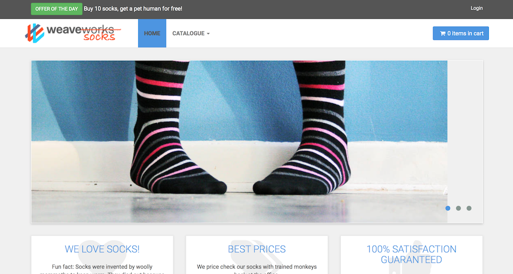

# Sock Shop : A Microservice Demo Application

The application is the user-facing part of an online shop that sells socks. It is intended to aid the demonstration and testing of microservice and cloud native technologies.

It is built using [Spring Boot](http://projects.spring.io/spring-boot/), [Go kit](http://gokit.io) and [Node.js](https://nodejs.org/) and is packaged in Docker containers.

You can read more about the [application design](./docs/design.md).

## Deployment Platforms

This repo includes configuration and scripts that deploy the application to the following platforms:

- [Amazon ECS](./deploy/aws-ecs/)
- [Docker](./deploy/docker-single/) (single host, e.g. Docker For Mac)
- [Docker Swarm](./deploy/docker-swarm/)
- [Docker Only (WeaveNet not required)] (./deploy/docker-only/)
- [Kubernetes](./deploy/kubernetes/)
- [Mesos (CNI)](./deploy/mesos-cni/)
- [Mesos + Marathon](./deploy/mesos-marathon/)

We're planning to add more platform deployment targets, but preferences or suggestions are welcome.

## Bugs, Feature Requests and Contributing

We'd love to see community contributions. We like to keep it simple and use Github issues to track bugs and feature requests and pull requests to manage contributions. See the [contribution information](./docs/contributing.md) for more information.

## Screenshot

## Visualizing the application

Use [Weave Scope](http://weave.works/products/weave-scope/) or [Weave Cloud](http://cloud.weave.works/) to visualize the application once it's running in the selected [target platform](./deploy/).

## 
