## Container-based microservices with AWS, Weave and Shippable

### Goal
In this scenario, you'll set up and run the containerized Socks Shop
eCommerce application, with fully automated deployments, in 30
minutes or less.

Your sample application will feature:

  * **Amazon ECS**{: style="color: orange"} for container orchestration
  * **Amazon ECR**{: style="color: orange"} for container registry
  * **Weave Scope**{: style="color: orange"} for service discovery and container visualization
  * **Shippable**{: style="color: orange"} for automated CI/CD

This page provides the instructions necessary to:  

  * Provision a Weave-enabled Amazon ECS cluster using Cloud Formations and
  deploy all components of the Sock Shop microservices demo application except
  the <a href="https://github.com/microservices-demo/front-end" style="color: orange">front-end</a>
   component
  * Configure a CI/CD pipeline to manage deployment of the
  <a href="https://github.com/microservices-demo/front-end" style="color: orange">
  front-end</a> service using Shippable

---

### Fork and clone the repos
To get started, you'll need to fork and clone two GitHub repos.

1. Fork the [microservices-demo](https://github.com/microservices-demo/microservices-demo){: style="color: orange"}
GitHub repo to your personal [GitHub account](https://github.com/join?source=header-home){: style="color: orange"}

2. 
Clone your fork locally on your machine
  
  * Click the green `Clone or download` button
  * Copy the URL for your forked repo that appears
  * Open a command line on your local machine and execute the command:
      <pre>$ git clone <i>your_forked_url</i></pre>

{:start="3"}
3. 
Repeat steps 1-3 for the <a href="https://github.com/microservices-demo/front-end"
style="color: orange">
front-end</a> repo

---

### Provision Amazon ECS cluster
Now, you'll provision a Weave-enabled Amazon ECS cluster and deploy all services
except for the front-end service.

1. Log into [Amazon Management Console](https://console.aws.amazon.com/console/home){: style="color: orange"}

2. Navigate to [CloudFormation](https://console.aws.amazon.com/cloudformation){: style="color: orange"}

3. Select `Create Stack`

4. Under `Choose a template`, select `Choose file` or `Browse`

5. Navigate to the directory where you cloned the 
microservices-demo repo
and choose to upload the file `./deploy/aws-ecs-shippable/cloudformation.json`

6. 
Complete the form fields with the following values and select `Next`

  * Stack name: `ecs-weave-shippable-demo`
  * DeployExampleApp: `Yes`
  * EcsInstanceType: `t2.medium`
  * KeyName: `choose an existing key pair or leave blank to create a new one`
  * Scale: `4`
  * WeaveCloudServiceToken: `leave blank`

{:start="7"}
7. Leave all form fields on the `Options` page as-is and select `Next`  

8. Click the `'I acknowledge ...'` boxes at bottom and select `Create`

**CloudFormation**{: style="color: orange"} will now create the entire stack
necessary to run your eCommerce demo app on Amazon ECS. This will several
minutes to complete and it will provision compute on AWS.

When your stack creation finishes with `CREATE_COMPLETE`, you'll find values of
AWS resources needed for the CI/CD pipeline setup available on the `Outputs` tab.
Take note of the following values:
  * TargetGroupARNTest
  * TargetGroupARNProd
  * TestALB
  * ProdALB  

---

### Configure an automated CI/CD pipeline

Your Weave-enabled Amazon ECS cluster should now be running 15 out of the 16 services
of the Socks Shop application (verify this by navigating to [EC2 Container Service](https://console.aws.amazon.com/ecs/home#/clusters/ecs-weave-shippable-demo/services)).
We'll use Shippable to set up an automated CI/CD pipeline to deploy the
<a href="https://github.com/microservices-demo/front-end" style="color: orange">
front-end</a> service.

1. Create a <a href="https://www.shippable.com" style="color: orange">Shippable</a>
account (if you don't already have one) by logging in with your
GitHub credentials

2. 
Enable the front-end repo for 
CI in Shippable

    * In your local copy of the `front-end` repo, you’ll need to update the `GROUP`
    environment variable in the shippable.yml configuration file with your values
    from your AWS environment (i.e. your Account ID and Region):
    * Replace the Amazon ECR registry URL with the URL for your Container registry,
    e.g. `288971733297.dkr.ecr.us-east-1.amazonaws.com/front-end` (you can copy/paste
      this URL by selecting `View Push Commands` on <a href="https://console.aws.amazon.com/ecs/home#/repositories/front-end#images;tagStatus=ALL" style="color: orange">this page</a>)
      <pre>
      env:
        global:
          - GROUP=288971733297.dkr.ecr.us-east-1.amazonaws.com
      </pre>

    * If you deployed your cluster to another region besides `us-east-1`, also
    update the `region` value accordingly:
      <pre>
      integrations:
        hub:
          - integrationName: shippable-ecr  # must match Subscription Integration in Shippable
            type: ecr
            region: us-east-1
      </pre>

    * Commit and push your changes to Github
      <pre>
      $ git commit -am 'update shippable.yml with my AWS details'
      $ git push origin master
      </pre>
    * Select your Subscription from the drop-down menu (three horizontal lines)
    in upper left
    * Select `Enable project` in left-hand nav
    * Find the `front-end` repo in the list and select `Enable`
    * Verify that your `front-end` project has been enabled:
    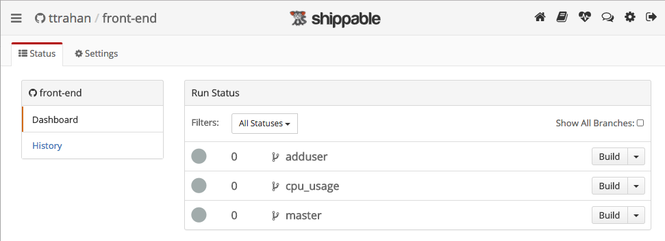{:width="600px"}

{:start="3"}
3. 
Create the front-end CD pipeline

In your local copy of the microservices-demo repo, you'll need to update
the `shippable.resource.yml` configuration file with values from your AWS
environment:
    * Resource `img-front-end`

      <pre>
      # Docker image information
        - name: img-front-end
          type: image
          pointer:
            sourceName: 288971733297.dkr.ecr.us-east-1.amazonaws.com/front-end
            isPull: false
          seed:
            versionName: master.1
      </pre>
      * Replace the Amazon ECR registry URL with the URL for your Container
      registry,  e.g. `288971733297.dkr.ecr.us-east-1.amazonaws.com/front-end`
      * You can copy/paste this URL by selecting `View Push Commands` on
      <a href="https://console.aws.amazon.com/ecs/home#/repositories/front-end#images;tagStatus=ALL" style="color: orange">
      this page</a> or finding the value for `EcrRepo` in your CloudFormation Outputs
      

    * Resource `alb-front-end-test`

      <pre>
      # AWS ALB target group for TEST environment
        - name: alb-front-end-test     #required
          type: loadBalancer      #required
          pointer:
            sourceName: "arn:aws:elasticloadbalancing:us-east-1:288971733297:targetgroup/frontendTESTTG/102776f0c4a71605"
            method: application
      </pre>
      * Replace the value for `sourceName` to be the ARN for your Target Group
      named `frontendTESTTG`
      * You can find this in <a href="https://console.aws.amazon.com/ec2/v2/home#TargetGroups:" style="color: orange">EC2-Target Groups</a>
      or in the value for `TargetGroupARNTest` in your CloudFormation Outputs
      

    * Resource `alb-front-end-prod`

      <pre>
      # AWS ALB target group for PROD environment
        - name: alb-front-end-prod     #required
          type: loadBalancer      #required
          pointer:
            sourceName: "arn:aws:elasticloadbalancing:us-east-1:288971733297:targetgroup/frontendPRODTG/1a91e8d308e7f76e"
            method: application
      </pre>
      * Replace the value for `sourceName` to be the ARN for your Target Group
      named `frontendPRODTG`
      * You can find this in <a href="https://console.aws.amazon.com/ec2/v2/home#TargetGroups:" style="color: orange">EC2-Target Groups</a>
      or in the value for `TargetGroupARNProd` in your CloudFormation Outputs
      

    If you're running your cluster in a region other than `us-east-1`:
    * Resource `cluster-demo-ecs`

      <pre>
      # AWS cluster information
        - name: cluster-demo-ecs
          type: cluster
          integration: shippable-aws
          pointer:
            sourceName : "ecs-weave-shippable-demo"
            region: "us-east-1"
      </pre>
      * Replace the value for `region` to be the AWS region where you're running
      your cluster
      

    Now, load your Pipeline configuration files into Shippable:
    
    * Select the `Pipelines` tab, `Resources` view, and then `Add Resource`
    button (far right)
    * In the Subscription Integrations dropdown: choose `Add integration` and
    complete the fields, as follows:
      * Name: name your integration `github`
      * Account Integrations: select `github` from the list
      * Projects Permissions: leave as `All projects`
      * Select `Save`
    * Select Project dropdown: choose `microservices-demo` project
    * Select Branch dropdown: choose `master`
    * Select `Save`
    * Select `SPOG` view and verify that your pipeline has been loaded
    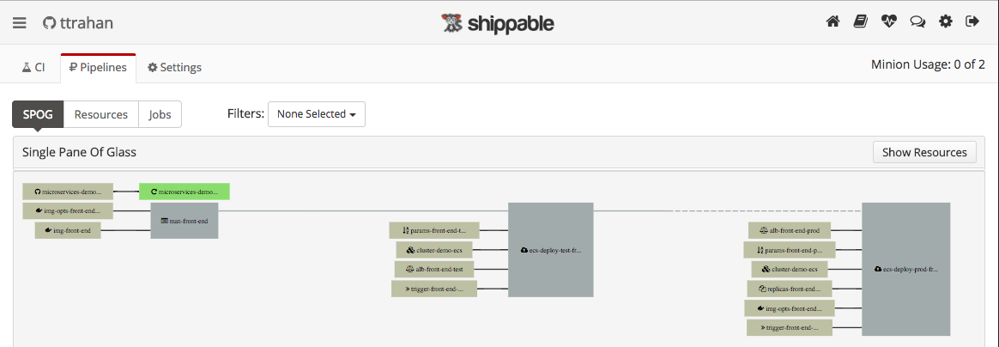{:width="600px"}

{:start="4"}
4. 
Configure an integration between Shippable
 and Amazon ECR

  * Navigate to `Account Settings` via the gear icon in the upper right
  * Select `Integrations` tab
  * Select `Add Integration`
    * Select `Amazon ECR` from the list and complete the fields, as follows:
      * Integration Name: name your integration `shippable-ecr`
      * Login to your AWS Management Console and navigate to the <a href="https://console.aws.amazon.com/iam/home#users" style="color: orange">shippableDemoUser</a> IAM user, select `Security credentials`, and then select `Create Access Key`
      * Copy/paste the Aws_access_key_id and Aws_secret_access_key into the
      Shippable fields (also, keep these values for use in step 5)
      * Select `Save`
  * Now, assign your Account Integration for use by your Subscription
    * Select your Subscription from the dropdown menu in upper left (three
      horizontal lines)
    * Select `Settings` tab, `Integrations` tab, and `Add Integration`
    * Complete the fields with the following values:
      * Name: shippable-ecr
      * Account Integrations: select `shippable-ecr` from the list
      * Project Permissions: leave `All projects` selected
      * Select `Save`
      

  
  {:width="600px"}

{:start="5"}
5. 
Configure an integration between Shippable
and Amazon ECS

  * Navigate to `Account Settings` via the gear icon in upper right
  * Select `Integrations` tab
  * Select `Add Integration`
    * Select `AWS` from the list
    * Name your integration `shippable-aws`
    * Copy/paste the `Aws_access_key_id` and `Aws_secret_access_key` into the
    Shippable fields (use the same values from step 4 above)
    * Select `Save`
  * Now, assign your Account Integration for use by your Subscription
    * Select your Subscription from the dropdown menu in upper left (three lines)
    * Select `Settings` tab, `Integrations` tab, and `Add Integration`
    * Complete the fields with the following values:
      * Name: shippable-aws
      * Account Integrations: select `shippable-aws` from the list
      * Project Permissions: leave `All projects` selected
      * Select `Save`

{:start="6"}
6. 
Link CI to your 
Pipeline via an Event Trigger

  * Navigate to `Account Settings` via the gear icon in upper right
  * Navigate to the 'API tokens' tab, create an API Token, and save it (you'll need
  it again shortly)
  * Select `Integrations` tab
  * Select `Add Integration`
    * Select `Event Trigger` from list
    * Name your integration `trigger-img-front-end`
    * Select `Resource` in the `Select Trigger` dropdown
    * Select the `img-front-end` resource you created in your pipeline
    * In Authorization field, enter 'apiToken ' + your API token from above
    * Select `Save`
    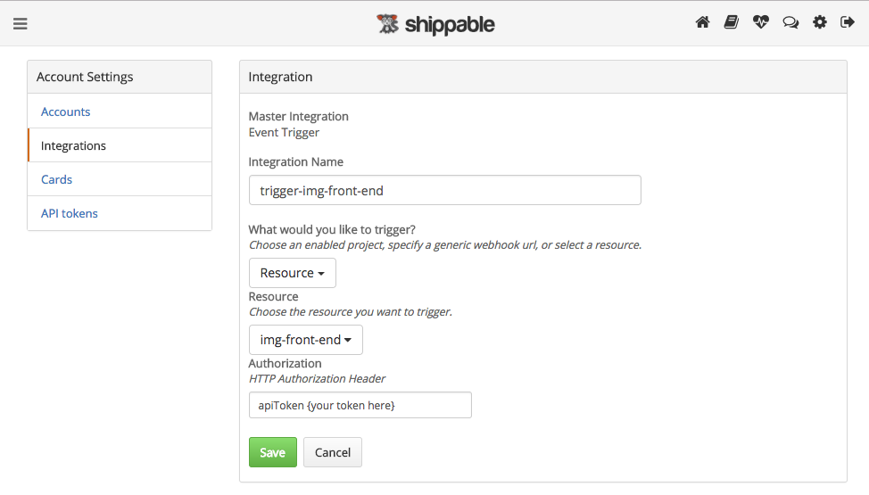{:width="600px"}  
  * Now, assign your Account Integration for use by your Subscription
    * Select your Subscription from the dropdown menu in upper left
    * Select `Settings` tab, `Integrations` tab, and `Add Integration`
    * Complete the fields with the following values:
      * Name: trigger-img-front-end
      * Account Integrations: select `trigger-img-front-end` from the list
      * Project Permissions: leave `All projects` selected
      * Select `Save`
      

    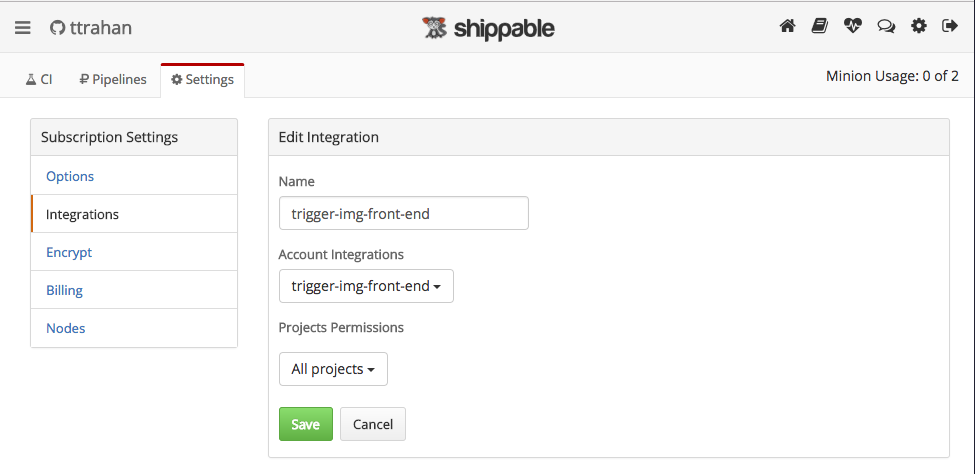{:width="600px"}

{:start="7"}
7. 
Run CI and trigger deployment of the `front-end` service to the
Test environment

  * Select the `CI` tab
  * Select the `Build` button for the `front-end` project
  * View the CI console as your CI run executes
  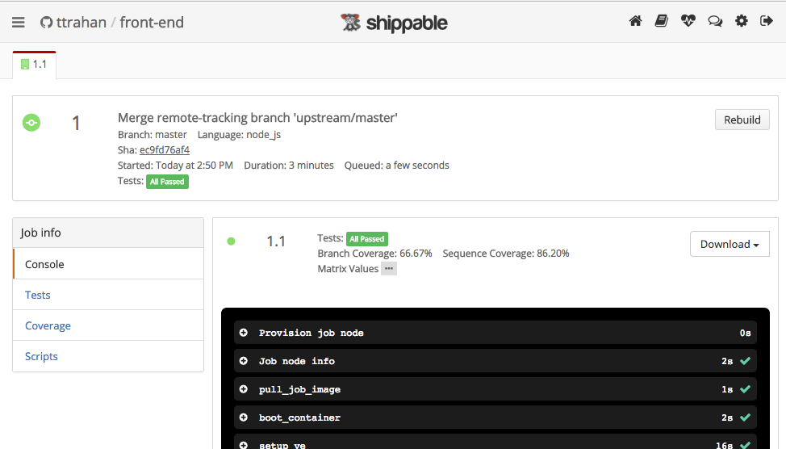{:width="600px"}
  * Navigate to the `Pipelines` tab and see your Pipeline execute
    * You'll see the CI job run and push a new image to Amazon ECR
    * Then a new Manifest job will run to update with the newest image tag
    * Then a Deploy job will run to deploy to Amazon ECS
  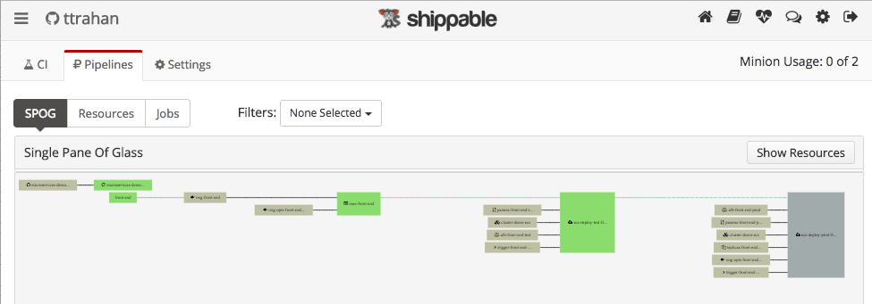{:width="600px"}
  * View your application running your `Test` front-end in your browser at `{your ALB address}:8080` (See CloudFormation-Outputs for address)
  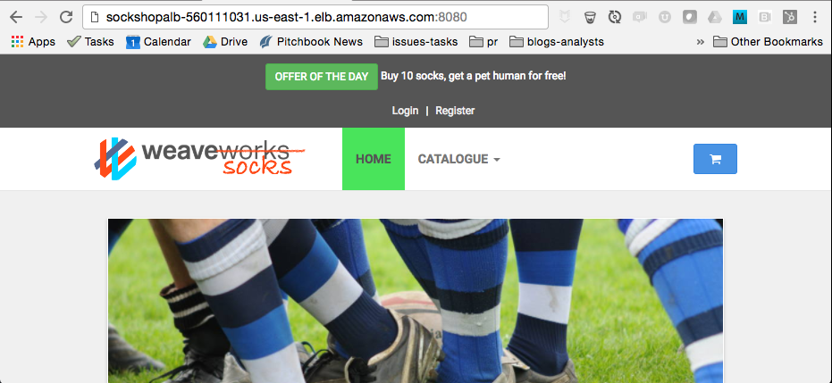{:width="600px"}

{:start="8"}
8. 
Deploy to the Prod environment

  * Right-click the `ecs-deploy-prod` job and select `Run`
  * A Deploy job will run and deploy a Prod instance of `front-end` to Amazon ECS
  * View your application running your `Prod` front-end in your browser at `{your ALB address}` (it should look identical to your `Test` front-end)

{:start="9"}
9. 
Make a change to your front-end service and 
auto-deploy to the Test environment

  * In your editor, open the `public/css/style.blue.css` file for the `front-end` repo
  * Toggle lines 1273 and 1274 (i.e. comment out line 1273, and un-comment line 1274 or
    vice-versa). This will switch the color of the active tab on the home page
    between blue and green.
    * Commit your changes to GitHub
      <pre>
      $ git commit -am 'update color of active tab on front-end home page'
      $ git push origin master
      </pre>
  * View the automated CI/CD flow in Pipeline view in Shippable, which will result
  in the code change being deployed to your Test environment
  * In your browser, navigate again to your Test environment (on port 8080) and
  confirm that the change was deployed successfully
  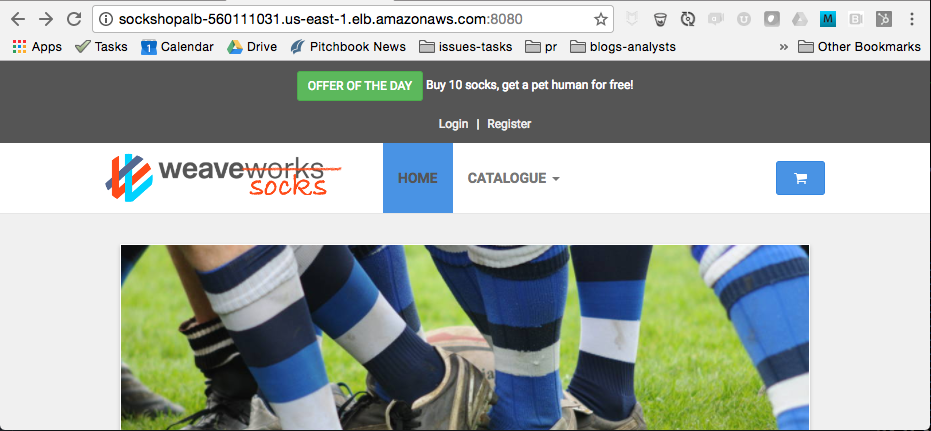{:width="600px"}

{:start="10"}
10. 
Explore!

  * Retrieve the IP address of any of your <a href="https://console.aws.amazon.com/ecs/home#/clusters/ecs-weave-shippable-demo/containerInstances" style="color: orange">cluster instances</a>
  * Navigate to `http://{your IP address}:4040` to view the Weave visualization of
  your containerized application. Click around to see various info on your services.
  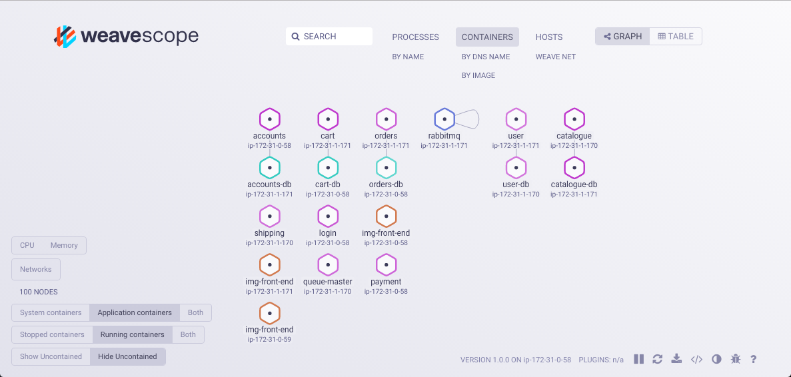{:width="600px"}  
  * Navigate to <a href="https://console.aws.amazon.com/ecs/home#/clusters/ecs-weave-shippable-demo/services" style="color: orange">the
  AWS Management Console</a> and explore the different elements of your cluster in Amazon ECS
  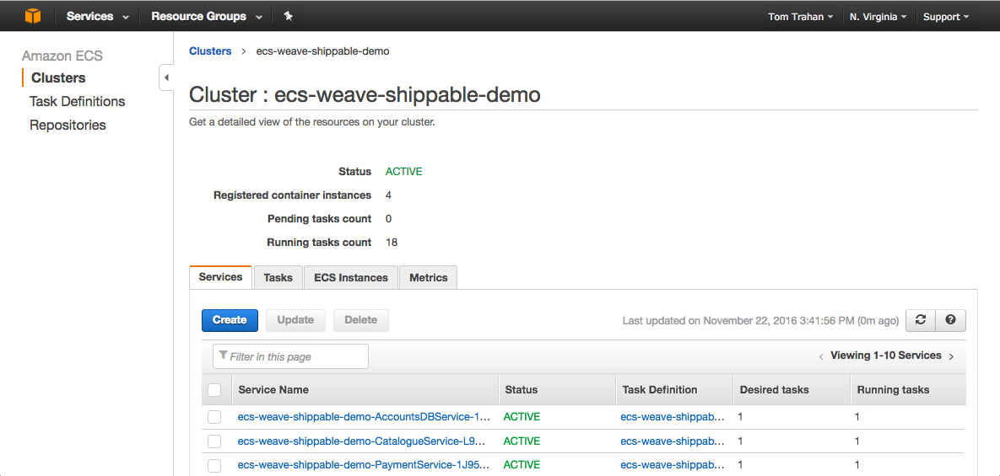{:width="600px"}
  * Navigate to your Amazon ECR repository to view your newly created Docker images
  * Select `Repositories` in the left-hand nav from your cluster page
  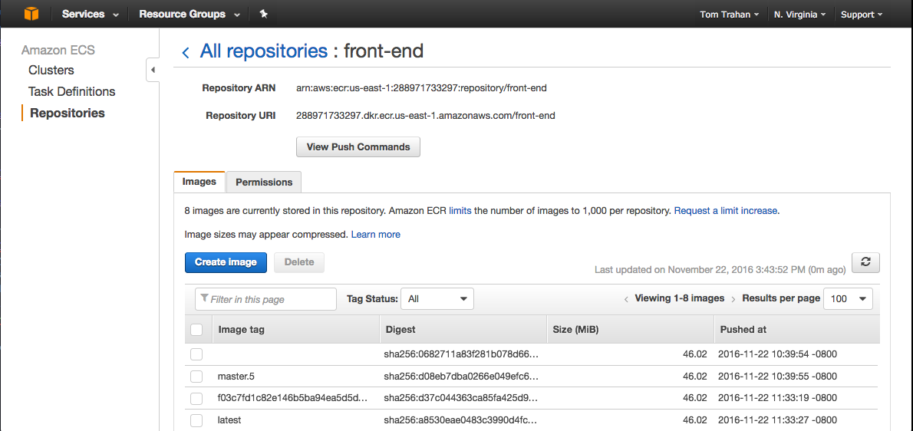{:width="600px"}

    * Explore additional elements of your Shippable Pipelines:
      * Select the `Jobs` view in the Pipelines tab and click on the `Latest Version`
      number for the `ecs-deploy-test-front-end` job.
      * For the most recent version, select `More` and `Trace` to see details of the
      elements included in this latest deployment to the Test environment
      * Expand the `man-front-end` Resource Name
  {:width="600px"}

---

### Delete your CloudFormation stack
When finished exploring, return to the <a href="https://console.aws.amazon.com/cloudformation/home#/stacks"
style="color: orange">AWS Management Console - CloudFormation page</a>, select the `ecs-weave-shippable-demo` stack, select `Actions` and `Delete
Stack` to remove all resources related to this demo.
